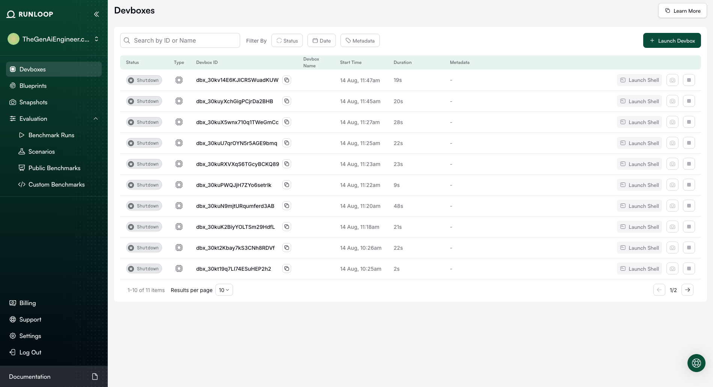

# Runloop Detective Agents 🕵️

AI-powered detective agents that solve real-world problems using [Runloop](https://runloop.ai)'s ephemeral infrastructure. Perfect for ad-hoc investigations, log analysis, and debugging without permanent setup.

## Overview

This project demonstrates **AI detective agents** that act as your "technical investigator" for complex problems:

1. **🔍 Analyzes mysterious log files** to identify patterns and root causes
2. **🚀 Spins up fresh, isolated environments** in seconds using Runloop
3. **🧠 Uses GPT-4 intelligence** to spot issues humans miss
4. **📊 Provides actionable insights** for debugging and optimization  
5. **💸 Automatically cleans up** - zero infrastructure to maintain

### Real-World Problem Solving

Instead of toy examples, these agents tackle **genuine debugging challenges**:

**🔍 Log Detective Agent**: Analyzes production logs to identify:
- Performance bottlenecks and memory leaks
- Error patterns and cascading failures  
- Security issues and anomalous behavior
- Database deadlocks and connection issues

**🎯 ASCII Art Demo**: Quick validation agent that:
- Tests your Runloop + OpenAI API setup
- Demonstrates basic agent architecture
- Provides confidence before tackling complex problems

## Prerequisites

- Python 3.9 or higher
- Poetry for dependency management
- OpenAI API key
- Runloop API key

## Installation

1. **Clone the repository**:
   ```bash
   git clone git@github.com:scriptstar/runloop-detective-agents.git
   cd runloop-detective-agents
   ```

2. **Install dependencies using Poetry**:
   ```bash
   poetry install
   ```

## Configuration

Create a `.env` file in the project root with your API keys:

```env
OPENAI_API_KEY=your_openai_api_key_here
RUNLOOP_API_KEY=your_runloop_api_key_here
```

## Usage

Run the agent:

```bash
poetry run python agent.py
```

### Expected Output

The agent will:
1. Log that it's creating a devbox
2. Generate and test a Python script
3. Display the final script code
4. Show the ASCII art output from running the script
5. Clean up by destroying the devbox

Example output:
```
INFO:agent:Starting agent demo
INFO:agent:Creating devbox ...
Here is the content of the final `script.py` file:

```python
import sys
import pyfiglet

if len(sys.argv) > 1:
    input_text = ' '.join(sys.argv[1:])
    ascii_art = pyfiglet.figlet_format(input_text)
    print(ascii_art)
else:
    print('No input provided')
```

And here is the verbatim output from the last time the program was run:

```
 _          _ _                          _                   
| |__   ___| | | ___    _ __ _   _ _ __ | | ___   ___  _ __  
| '_ \ / _ \ | |/ _ \  | '__| | | | '_ \| |/ _ \ / _ \| '_ \ 
| | | |  __/ | | (_) | | |  | |_| | | | | | (_) | (_) | |_) |
|_| |_|\___|_|_|\___/  |_|   \__,_|_| |_|_|\___/ \___/| .__/ 
                                                      |_|    
```
INFO:agent:Destroying devbox dbx_xxx...
```

## Advanced Use Cases

While this example demonstrates ASCII art generation, the Runloop infrastructure enables much more sophisticated agentic applications:

### 🔒 **Code Review & Security Scanner**
Analyze uploaded code for security vulnerabilities, code smells, and best practices. Run static analysis tools (bandit, pylint, etc.) in isolated environments and provide detailed reports with suggested fixes.

### 🛡️ **Dependency Vulnerability Checker**
Scan project dependencies for known security issues, test different versions in sandbox environments to verify compatibility, and generate upgrade recommendations with automated testing.

### 🌐 **API Integration Tester**
Take API documentation and generate comprehensive test clients. Create test suites for REST/GraphQL APIs, validate responses against schemas, and perform load testing in controlled environments.

### 📊 **Log File Analyzer**
Process server logs to identify patterns, errors, and anomalies. Generate insights about system performance, detect potential issues, and create monitoring alerts based on intelligent log analysis.

### 🔄 **Data Processing Pipeline**
Convert between different data formats (CSV, JSON, XML, Parquet), clean and validate data with custom rules, and generate data quality reports with transformation scripts.

### 📚 **Automated Documentation Generator**
Analyze codebases and generate comprehensive documentation. Create API documentation from code annotations and build deployment guides with setup instructions.

### ⚙️ **Environment Setup Automator**
Take project requirements and create containerized development environments. Generate Docker configurations, CI/CD pipelines, and test setup scripts across different operating systems.

### ⚡ **Performance Benchmarking Agent**
Run performance tests on code snippets or applications, compare different implementation approaches, and generate optimization recommendations with detailed metrics.

Each of these applications leverages Runloop's sandboxed execution environment to safely run analysis tools, execute code, and perform complex operations without affecting the host system.

## The Runloop Advantage

### Why Not Just Use Existing Tools?

You might wonder: "Don't we already have tools for dependency scanning (Dependabot), data pipelines (Airflow), API testing (Postman), and code analysis (SonarQube)?" 

**You're absolutely right!** These mature tools excel at **permanent, recurring workflows** with established infrastructure.

### Where Runloop Shines: Interactive Problem Solving

Runloop's unique value lies in **ad-hoc, interactive analysis** that doesn't warrant setting up permanent infrastructure:

#### 🔍 **Technical Detective Work**
- *"Here's a weird log file from production - what's causing these intermittent errors?"*
- *"Can you reverse-engineer this API from these network traces?"*
- *"Analyze this crash dump - what went wrong during deployment?"*

#### 📊 **Exploratory Data Analysis**
- *"I have this CSV with messy data - can you clean it and find patterns?"*
- *"Here's a database dump from a legacy system - what's the schema?"*
- *"Compare these two datasets and tell me what changed?"*

#### 🚨 **Incident Response**
- *"The system is behaving strangely - analyze these metrics and configs"*
- *"Here are memory dumps from different servers - is there a pattern?"*
- *"Parse this complex error output and suggest fixes"*

### The Key Difference

| Traditional Tools | Runloop AI Agents |
|------------------|-------------------|
| ✅ Permanent workflows | ✅ One-off investigations |
| ✅ Known, recurring tasks | ✅ Unknown, exploratory problems |
| ✅ Production infrastructure | ✅ Temporary, sandboxed analysis |
| ✅ Team-wide standardization | ✅ Individual problem-solving |

**Think of Runloop agents as your "technical detective assistant"** - when you need to investigate something unusual, explore unknown data, or debug a complex issue without setting up permanent tooling.

## How Runloop Works: Ephemeral Infrastructure Magic

Every time you run our agents, here's what happens behind the scenes:



### 🚀 **Zero Infrastructure Management**
- **Automatic creation**: Fresh, isolated devbox spins up in seconds
- **Task execution**: Your agent runs safely in the sandboxed environment  
- **Instant cleanup**: Devbox automatically shuts down when task completes
- **No lingering costs**: Pay only for seconds of actual compute time

### ⚡ **Ultra-Short Lifecycles**
Notice the durations in the screenshot: **2s, 9s, 19s, 20s, 21s, 22s, 23s, 28s, 48s**

These represent complete agent execution cycles - from devbox creation, through log analysis, to automatic shutdown. Perfect for:
- **One-off investigations** - no permanent setup required
- **Cost efficiency** - pay per second of actual use
- **Security** - each analysis in fresh, isolated environment
- **Scalability** - create thousands of devboxes without infrastructure overhead

### 🎯 **Perfect for "Technical Detective" Work**
This ephemeral model is exactly why Runloop excels at **ad-hoc problem solving** rather than permanent workflows. When you need to investigate a mysterious log file or debug a complex issue, you get a clean environment, perform your analysis, and everything disappears automatically.

---

## Getting Started: Two Learning Approaches

This project includes **two agents** designed for different stages of your Runloop journey:

### 🚀 **Quick Start** - ASCII Art Demo (`agent.py`)
**Perfect for first-time users** - validates your setup and demonstrates core concepts:

```bash
# Start here: simple but impressive demo
poetry run python agent.py
```

**What it does:**
- Creates a Python script that converts text to ASCII art
- Shows basic Runloop + ELL + GPT-4 integration  
- **Just 47 lines** of core logic - easy to understand
- Validates your API keys and devbox connectivity
- Fun way to see "AI coding in a sandbox" in action

### 🕵️ **Advanced Usage** - Log Detective Agent (`log_detective_agent.py`)
**Ready for real-world problems** - sophisticated log analysis with AI:

```bash
# When ready for serious work: analyze actual log files
poetry run python log_detective_agent.py sample_logs/webapp_access.log
```

**What it does:**
- Analyzes any log file with AI-powered pattern recognition
- **271 lines** with smart chunking for files up to 10MB+
- Provides actionable debugging recommendations
- Demonstrates production-ready agentic capabilities

### 📈 **Recommended Learning Path**
1. **First**: Run the ASCII demo to validate setup and get excited
2. **Then**: Analyze sample logs to see real problem-solving power  
3. **Finally**: Use your own log files for actual debugging

---

## Deep Dive: Log Detective Agent

Our **Log Detective Agent** perfectly demonstrates the "technical detective assistant" concept:

### Usage

```bash
# Analyze any log file
poetry run python log_detective_agent.py /path/to/your/logfile.log

# Example with sample data
poetry run python log_detective_agent.py sample_logs/webapp_access.log
```

### What It Does

1. **Uploads your log file** to a secure, sandboxed Runloop devbox
2. **Analyzes patterns** using AI - timestamps, errors, performance issues
3. **Generates insights** - root causes, anomalies, actionable recommendations  
4. **Handles large files** intelligently with smart chunking (tested up to 10MB+)
5. **Cleans up automatically** - no permanent infrastructure left behind

### Example Output

```
================================================================================
LOG DETECTIVE ANALYSIS: webapp_access.log
================================================================================
### Key Findings:
- **Timeline**: 24-hour period with 15,000 requests
- **Critical Issues**: 47 HTTP 500 errors clustered around 14:30-15:00
- **Performance**: Response times degraded 300% during peak hours
- **Recommendations**: 
  1. Investigate database connection pool exhaustion
  2. Check memory usage during 14:30-15:00 window
  3. Review rate limiting configuration
================================================================================
```

## Project Structure

```
coding-agent/
├── agent.py                     # 🎯 Simple ASCII art demo (start here!)
├── log_detective_agent.py       # 🕵️ Advanced log analysis with AI + smart chunking
├── sample_logs/                 # 🧪 Synthetic test data for immediate testing
│   ├── README.md                   # Guide to each sample log file
│   ├── webapp_access.log           # Web server logs with performance issues
│   ├── application_debug.log       # Memory leaks, crashes, error patterns
│   ├── microservice_errors.log     # Service failures and correlations
│   └── database_performance.log    # Query optimization opportunities
├── pyproject.toml               # Poetry dependencies and configuration
├── .env                        # Environment variables (create this)
├── .gitignore                  # Git ignore patterns
└── README.md                   # This guide
```

### Agent Comparison

| Feature | `agent.py` | `log_detective_agent.py` |
|---------|------------|---------------------------|
| **Purpose** | Learning & validation | Real-world problem solving |
| **Complexity** | 47 lines core logic | 271 lines with advanced features |
| **Best for** | First-time users | Experienced developers |
| **Input** | None (generates ASCII art) | Any log file path |
| **Output** | Fun ASCII art demo | Detailed analysis report |
| **File size limits** | N/A | Up to 10MB+ (smart chunking) |

## Key Components

### Dependencies

- **runloop-api-client**: Interface to Runloop's devbox infrastructure
- **openai**: OpenAI API client for GPT-4 access
- **ell-ai**: Library for building language model programs with tool binding
- **python-dotenv**: Environment variable management

### Agent Architecture

The agent uses ELL's `@ell.complex` decorator to create a language model program with access to three tools:

1. **execute_shell_command**: Run commands in the devbox
2. **read_file**: Read file contents from the devbox
3. **write_file**: Write content to files in the devbox

### Safety Features

- **Sandboxed execution**: All code runs in isolated Runloop devboxes
- **Automatic cleanup**: Devboxes are destroyed after use
- **Iteration limits**: Maximum of 10 iterations to prevent infinite loops

## Troubleshooting

### Common Issues

1. **Missing API keys**: Ensure both `OPENAI_API_KEY` and `RUNLOOP_API_KEY` are set in your `.env` file

2. **Python version**: The project requires Python 3.9+ due to the `ell-ai` dependency

3. **Poetry installation**: If Poetry isn't installed, follow the [official installation guide](https://python-poetry.org/docs/#installation)

### Error Messages

- `"OPENAI_API_KEY is not set"`: Add your OpenAI API key to the `.env` file
- `"RUNLOOP_API_KEY is not set"`: Add your Runloop API key to the `.env` file
- `"ModuleNotFoundError: No module named 'sqlmodel'"`: Run `poetry install` to install all dependencies

## License

This project is provided as an example/demo. Please refer to the respective licenses of the dependencies used.

## Links

- [Runloop Documentation](https://runloop.ai)
- [ELL Library Documentation](https://docs.ell.so)
- [OpenAI API Documentation](https://platform.openai.com/docs)